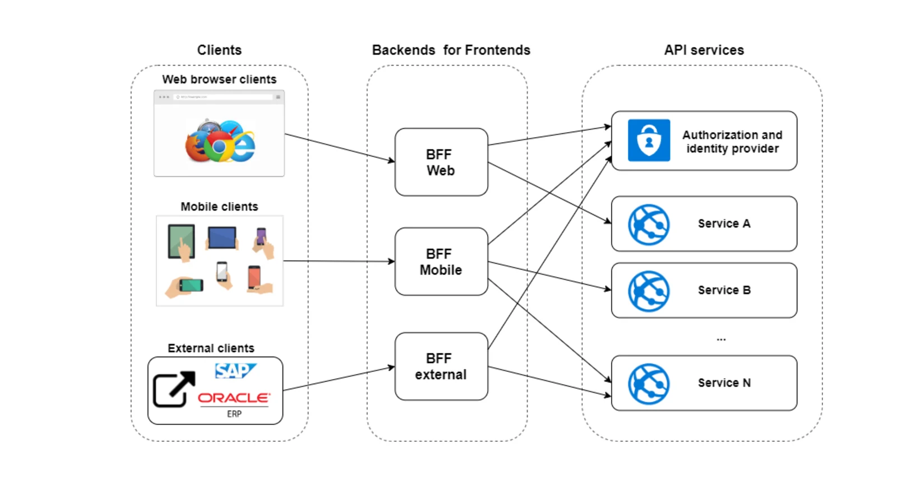

# microservices-architecture
Microservices patterns and architecture

## API Gateway

The API Gateway acts as a reverse proxy that routes API requests from the client applications to the internal microservices endpoints. It also takes care of some cross-cutting concerns like authentication, SSL termination, and cache.

## Multiple API Gateways aka Backend for Frontend (BFF) Pattern

Think of this as horizontal scaling (sharding) of the API Gateway functionality. Example, we expect a spike in the traffic from the mobile users, and it is communicates only to the several of the microcervices. Solution: configure different API gateways for mobile and web clients.

